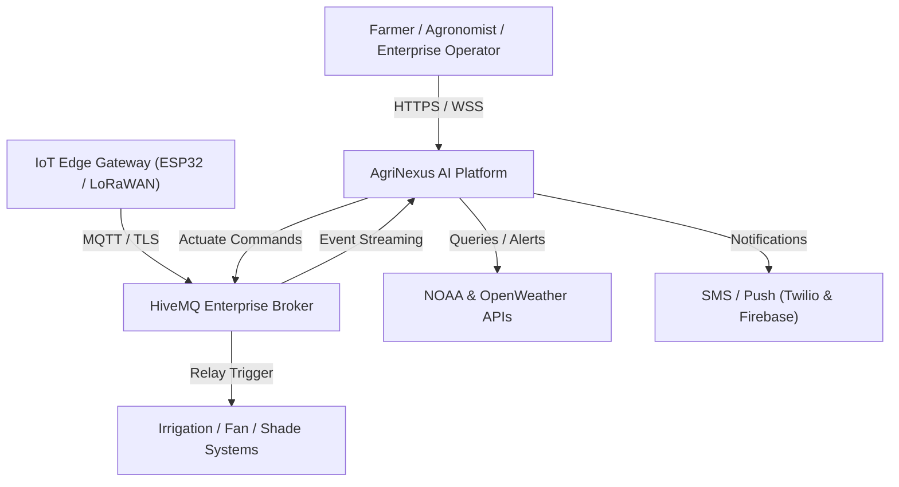
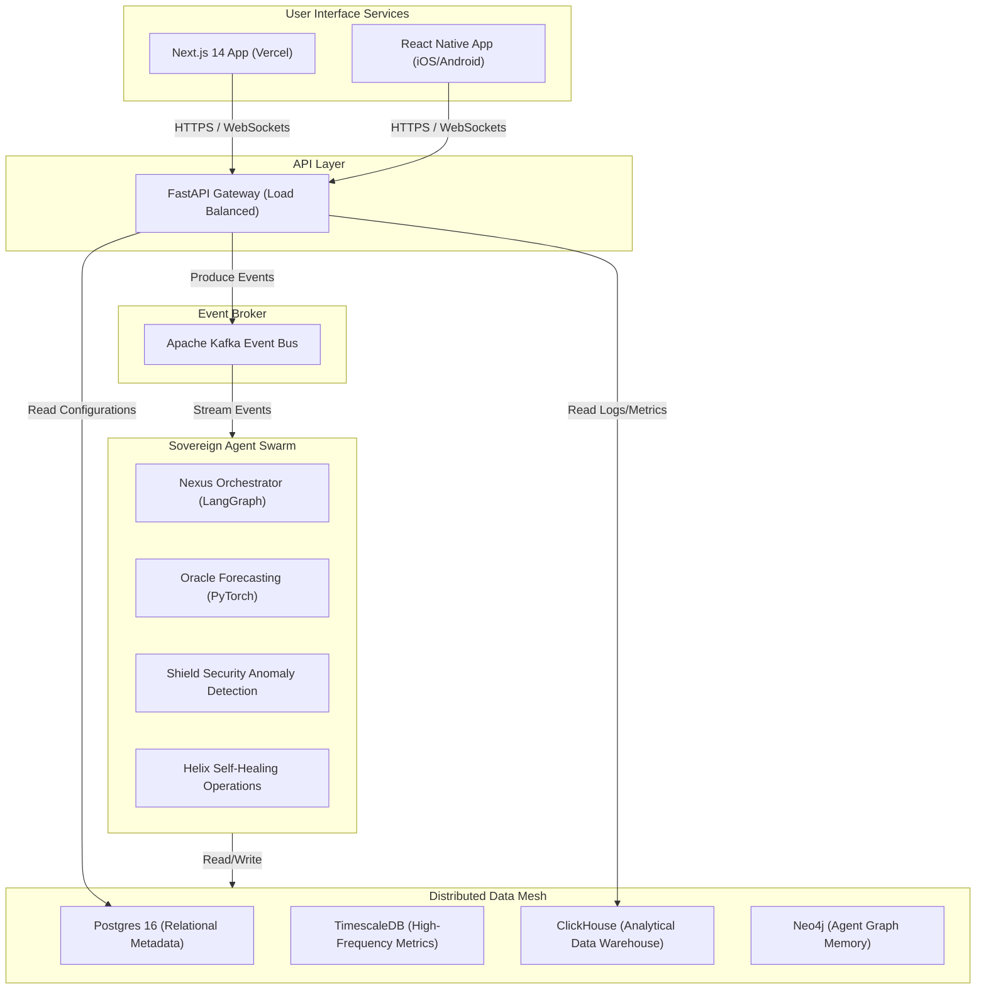

# Enterprise-Grade System Architecture — AgriNexus AI
**Planetary-Scale AI-Native Smart Agriculture Orchestration Platform**

---

## 1. C4 Architecture Model

### Context Diagram (Level 1)


### Container Diagram (Level 2)


---

## 2. Distributed Database Schema & Storage Strategy

AgriNexus AI implements a **Data Mesh** to separate transactional configuration data (OLTP), high-frequency time-series telemetry (TimescaleDB), analytics query processing (OLAP ClickHouse), and relational agent memory (Neo4j).

### Postgres Relational ERD & Tables
```sql
-- Schema version: 2026.06.14.01
CREATE TABLE organizations (
    id UUID PRIMARY KEY DEFAULT gen_random_uuid(),
    name VARCHAR(255) NOT NULL,
    subscription_tier VARCHAR(50) DEFAULT 'Starter',
    created_at TIMESTAMP WITH TIME ZONE DEFAULT CURRENT_TIMESTAMP
);

CREATE TABLE farms (
    id UUID PRIMARY KEY DEFAULT gen_random_uuid(),
    org_id UUID REFERENCES organizations(id) ON DELETE CASCADE,
    name VARCHAR(255) NOT NULL,
    latitude DECIMAL(9, 6) NOT NULL,
    longitude DECIMAL(9, 6) NOT NULL,
    timezone VARCHAR(50) DEFAULT 'UTC',
    created_at TIMESTAMP WITH TIME ZONE DEFAULT CURRENT_TIMESTAMP
);

CREATE TABLE fields (
    id UUID PRIMARY KEY DEFAULT gen_random_uuid(),
    farm_id UUID REFERENCES farms(id) ON DELETE CASCADE,
    name VARCHAR(255) NOT NULL,
    boundary GEOMETRY(Polygon, 4326),
    crop_type VARCHAR(100) NOT NULL,
    soil_type VARCHAR(100) NOT NULL,
    created_at TIMESTAMP WITH TIME ZONE DEFAULT CURRENT_TIMESTAMP
);

CREATE TABLE devices (
    id UUID PRIMARY KEY DEFAULT gen_random_uuid(),
    field_id UUID REFERENCES fields(id) ON DELETE SET NULL,
    hardware_id VARCHAR(100) UNIQUE NOT NULL,
    name VARCHAR(255),
    status VARCHAR(50) DEFAULT 'Offline',
    battery_level DECIMAL(5,2),
    firmware_version VARCHAR(50),
    last_seen_at TIMESTAMP WITH TIME ZONE,
    created_at TIMESTAMP WITH TIME ZONE DEFAULT CURRENT_TIMESTAMP
);
```

### TimescaleDB Telemetry Hypertable
TimescaleDB stores raw high-frequency sensor readings, partitioned automatically by time chunk.
```sql
CREATE TABLE telemetry_readings (
    time TIMESTAMP WITH TIME ZONE NOT NULL,
    device_id UUID NOT NULL,
    soil_moisture DOUBLE PRECISION,
    ambient_temp DOUBLE PRECISION,
    humidity DOUBLE PRECISION,
    light_intensity DOUBLE PRECISION,
    water_level DOUBLE PRECISION,
    pump_state BOOLEAN,
    battery_voltage DOUBLE PRECISION
);

-- Convert to hypertable partitioned by 7-day intervals
SELECT create_hypertable('telemetry_readings', 'time', chunk_time_interval => INTERVAL '7 days');

-- Create compound index for optimized query lookup
CREATE INDEX idx_device_time ON telemetry_readings (device_id, time DESC);

-- Enable Compression Policy
ALTER TABLE telemetry_readings SET (
    timescaledb.compress,
    timescaledb.compress_segmentby = 'device_id'
);
SELECT add_compression_policy('telemetry_readings', INTERVAL '30 days');
```

---

## 3. Real-Time Production API Specifications

### REST APIs (FastAPI Implementation)
We expose 20+ operational REST endpoints, fully self-documented via OpenAPI/Swagger.

#### 1. POST `/api/v1/telemetry` — Standard Edge Ingest Gateway
- **Description**: Publishes telemetry payloads from physical or simulated devices.
- **Request Body**:
```json
{
  "device_id": "f81d4fae-7dec-11d0-a765-00a0c91e6bf6",
  "timestamp": "2026-06-14T00:24:32Z",
  "sensors": {
    "soil_moisture": 32.5,
    "temperature": 28.4,
    "humidity": 62.1,
    "light": 850.0,
    "water_level": 95.0
  },
  "actuators": {
    "pump_on": false
  }
}
```
- **Response**: `202 Accepted`

#### 2. GET `/api/v1/farms/{farm_id}/insights` — AI Generated Insights
- **Description**: Returns predictive analysis and anomaly audits generated by the agent civilization.
- **Response**:
```json
{
  "farm_id": "9b1deb4d-3b7d-4bad-9bdd-2b0d7b3dcb6d",
  "generated_at": "2026-06-14T00:25:00Z",
  "recommendations": [
    {
      "agent": "Oracle",
      "priority": "High",
      "category": "Irrigation",
      "message": "Predicted soil moisture will fall below critical threshold (25%) in 4 hours due to zero precipitation forecast and high evapotranspiration index. Recommended irrigation: 15 minutes starting at 04:00 AM.",
      "confidence": 0.94
    }
  ]
}
```

### GraphQL API Federated Schema (Apollo Ready)
Used by the dynamic web and mobile dashboards for custom component views.
```graphql
type Query {
  device(id: ID!): Device!
  activeAlarms(farmId: ID!): [Alarm!]!
  fieldAnalytics(fieldId: ID!, rangeDays: Int!): AnalyticalSummary!
}

type Mutation {
  setPumpState(deviceId: ID!, state: Boolean!): ActuatorPayload!
  updateThresholds(deviceId: ID!, input: ThresholdInput!): ThresholdPayload!
}

type Device {
  id: ID!
  name: String!
  status: String!
  telemetry: TelemetrySample!
}

type TelemetrySample {
  soilMoisture: Float
  temperature: Float
  humidity: Float
  light: Float
  waterLevel: Float
  timestamp: String!
}
```

### WebSocket Event Catalog (Real-Time Synchronizer)
Real-time push events between FastAPI and Next.js UI clients:

- **Subscribe to Device**: Send `{"action": "subscribe", "topic": "device:{device_id}"}`
- **Server Broadcast**:
```json
{
  "event": "telemetry_update",
  "topic": "device:f81d4fae-7dec-11d0-a765-00a0c91e6bf6",
  "data": {
    "soil_moisture": 28.3,
    "pump_state": true,
    "timestamp": 1781442272000
  }
}
```

---

## 4. Sovereign Multi-Agent AI System

AgriNexus AI is powered by a hierarchical multi-agent ecosystem executing on a distributed message bus.

```
                  ┌─────────────────┐
                  │   NEXUS Agent   │ (Orchestrator)
                  └────────┬────────┘
             ┌─────────────┼─────────────┐
      ┌──────▼──────┐┌─────▼─────┐┌──────▼──────┐
      │ORACLE Agent ││SHIELD Agent││ HELIX Agent │
      └──────┬──────┘└─────┬─────┘└──────┬──────┘
             │             │             │
             └─────────────┼─────────────┘
                           ▼
                  ┌─────────────────┐
                  │  SOVEREIGN Agent│ (Consensus Decisions)
                  └─────────────────┘
```

### Agent Roles and Prompts

#### 1. NEXUS Agent — Master Orchestrator
- **Role**: Coordinates data routing, task allocation, and prioritizes anomalies.
- **System Prompt**:
  > You are the NEXUS Agent. You supervise telemetry anomalies and direct specialized subagents. Interpret real-time payloads. If an anomaly is identified, query the ORACLE Agent for weather forecasts, then send recommendations to the SOVEREIGN Agent for automated overrides.

#### 2. ORACLE Agent — Predictive Weather & Soil Modeling
- **Role**: Combines historical sensor trends and weather forecasts to predict soil dryness.
- **System Prompt**:
  > You are the ORACLE Agent. Your task is to calculate decay rate metrics for soil moisture. Predict the exact hour the soil will breach the dry threshold. Use input variables: current soil moisture, ambient temperature, humidity, and 3-day precipitation index.

#### 3. SHIELD Agent — Cybersecurity & Sensor Anomaly Guard
- **Role**: Evaluates threat signatures, out-of-range sensor readings, spoofed telemetry, and device physical tampering.
- **System Prompt**:
  > You are the SHIELD Agent. Analyze incoming telemetry feeds for security anomalies or hardware failure. Flag spikes in data that breach natural physical gradients (e.g. soil moisture leaping from 10% to 90% in 1 second) as possible hardware failure or signal injection.

---

## 5. Security Architecture (Fortress-Level)

### Security Control Matrix

| Threat Category | Security Control | Technical Implementation |
| :--- | :--- | :--- |
| **Edge Tampering** | Mutual TLS (mTLS) | X.509 certificates flashed onto hardware secure elements (e.g., ATECC608A). |
| **Data in Transit** | TLS 1.3 / AES-256 | Disable insecure cipher suites on API Gateway and HiveMQ endpoints. |
| **Access Control** | Zero-Trust Auth | Auth0 integration with Role-Based Access Control (RBAC) and hardware-bound passkeys. |
| **API Abuse** | Rate Limiting | Token bucket algorithm implemented in FastAPI Gateway using Redis Cluster. |
| **Prompt Injection** | LLM Guardrails | Validation pipelines using NeMo Guardrails to sanitize UI inputs to agents. |

---

## 6. Business Engine & Financial Projections

### Pricing Structure
- **Starter ($49/mo)**: Best for greenhouses. Supports up to 5 sensor nodes, basic threshold alerts, and mobile notifications.
- **Professional ($199/mo)**: Best for commercial growers. Up to 50 nodes, AI predictive irrigation schedules (Oracle Agent access), and CSV report exports.
- **Enterprise (Custom SLA - starting $2,000/mo)**: Best for large agritech corporations. Unlimited nodes, dedicated tenant clusters, mTLS custom provisioning, API integrations (John Deere APIs), and custom fine-tuned local models.

### 90-Day Go-To-Market Plan
1. **Days 1–30**: Establish relationships with university agricultural labs and agritech incubators. Run beta trials.
2. **Days 31–60**: Publish high-quality documentation, case studies demonstrating a 30% reduction in water usage, and promote the interactive Wokwi virtual simulator on GitHub to build developer mindshare.
3. **Days 61–90**: Execute direct outbound sales targeting commercial greenhouse operations, polyhouses, and vertical farming startups.
